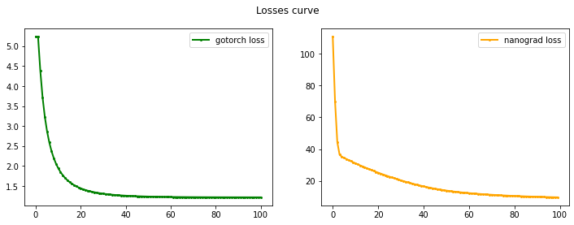

<div>
<h1>GoTorch</h1>

</div>


[](https://github.com/emersion/stability-badges#unstable)
[](https://github.com/emersion/stability-badges#unstable)
[](https://github.com/emersion/stability-badges#unstable)
[](https://pkg.go.dev/github.com/Godwinh19/gotorch)

GoTorch is a golang package for deep learning.

The objective is to offer a neural network development environment following the workflow of pytorch.


## Usage

This package is still under development. However, if you'll like to give a try, below is an example.

### A sample code

```go

package main

import (
	"github.com/Godwinh19/gotorch/torch/nn"
	t "github.com/Godwinh19/gotorch/torch/tensor"
)

func main() {
    x1 := t.Rand(20, 4)
	a1 := nn.Activation{Name: "tanh"}
	l1 := nn.Linear{InputSize: 4, OutputSize: 5, Activation: a1}

	a2 := nn.Activation{Name: "relu"}
	l2 := nn.Linear{InputSize: 5, OutputSize: 3, Activation: a2}
    
	a3 := nn.Activation{Name: "tanh"}
	l3 := nn.Linear{InputSize: 3, OutputSize: 1, Activation: a3}

	var output, grad t.Tensor
	var currentLoss float64
	net := nn.NeuralNet{NLinear: []*nn.Linear{&l1, &l2, &l3}}
	optim := nn.SGD{Lr: 0.00001}
	loss := nn.MSELoss{Actual: t.Rand(20,1)}

    // training
    for i := 0; i < 10; i++ {

        // Zero gradients for every batch!
        optim.ZeroGradients(net)
        
        // Make predictions for this batch
        output, _ = net.Forward(x1)

        // Compute the loss and its gradients
        loss.Predicted = output
        grad = nn.Gradient(loss)

        currentLoss = float64(nn.Loss(loss).Data[0][0])
        net.Backward(grad)

        // Adjust learning weights
        optim.Step(net)
        
        if i % 5 == 0 {
            fmt.Println(currentLoss)
        }
    }
}

```

## Contributions

Your contributions are very welcome !

You can also check out [nanograd](https://github.com/Godwinh19/nanograd) an autograd library that I'm writing using Python.

Here is a losses comparison:


Your can reach me on [twitter](https://twitter.com/GodwinHoudji) or [linkedin](https://www.linkedin.com/in/godwin-houdji) ☕
